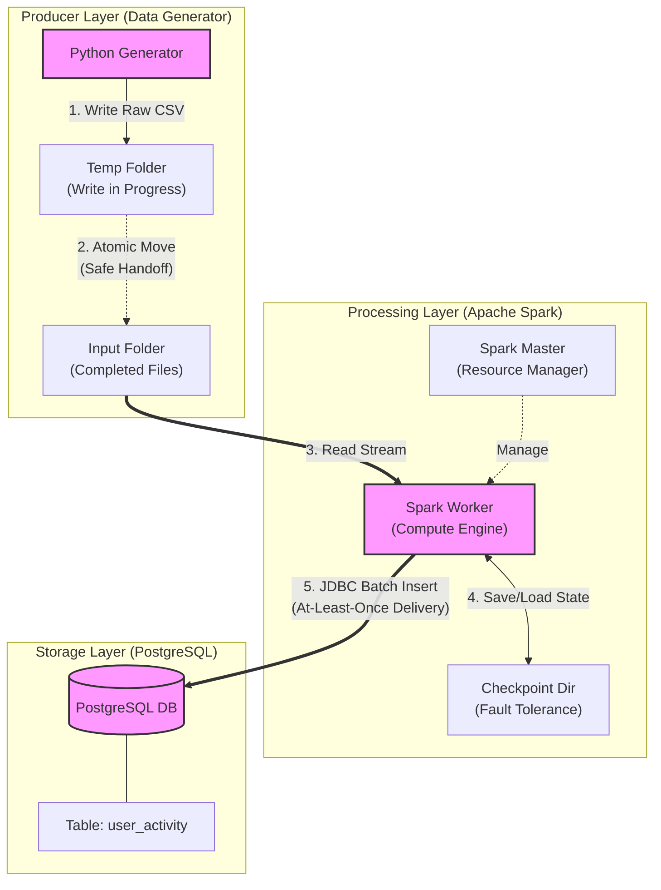

# Real-Time Data Ingestion Pipeline

**Author:** Courage Dei  
**Role:** Data Engineering Trainee  
**Module:** DE05: Lab 2 - Real-Time Data Ingestion Using Spark & PostgreSQL

---

##  Project Overview

This project implements a robust, fault-tolerant real-time data pipeline that simulates an e-commerce platform. It generates synthetic user event data (views, purchases), streams it using **Apache Spark Structured Streaming**, and ingests the processed data into a **PostgreSQL** database for analytics.

The entire infrastructure is containerized using **Docker** to ensure reproducibility and isolation.

###  System Architecture

The pipeline is designed with **Fault Tolerance** and **Data Integrity** as core principles.




##  Tech Stack

* **Infrastructure:** Docker & Docker Compose
* **Orchestration:** Apache Spark (Master/Worker Architecture)
* **Streaming Engine:** Spark Structured Streaming (Python/PySpark)
* **Database:** PostgreSQL 15
* **Language:** Python 3.9+
* **Libraries:** Faker, Pandas, Psycopg2

---

##  Project Structure

```text
streaming_pipeline/
├── data/
│   ├── input/             # Hot folder for new CSV files (Shared Volume)
│   └── checkpoints/       # Spark metadata for fault tolerance
├── sql/
│   └── postgres_setup.sql # Database schema initialization script
├── src/
│   ├── data_generator.py  # Producer script (Fake Data)
│   └── spark_streaming_to_postgres.py # Consumer script (ETL)
├── Dockerfile             # Custom Spark image with Dependencies
├── docker-compose.yml     # Multi-container orchestration
├── requirements.txt       # Python dependencies
└── README.md              # Project Documentation

```

---

##  How to Run the Pipeline

### Prerequisites

* Docker Desktop installed and running.
* Internet access (to pull Docker images).

### Step 1: Start Infrastructure

Build the custom images and start the containers in detached mode.

```bash
    docker-compose up --build -d
```

### Step 2: Verify Database

Ensure the `user_activity` table was created automatically.

```bash
    docker exec -it postgres_db psql -U myuser -d ecommerce_db -c "\dt"
```

### Step 3: Start the Data Generator (Producer)

This script will start creating CSV files in the `data/input` folder.

```bash
    docker exec -it spark_master python3 /app/src/data_generator.py
```

*(Keep this terminal open)*

### Step 4: Submit the Spark Job (Consumer)

Open a **new terminal** and run the Spark streaming job.

```bash
    docker exec -it spark_master /opt/spark/bin/spark-submit \
--jars /opt/spark/jars/postgresql-42.6.0.jar \
/app/src/spark_streaming_to_postgres.py
```

### Step 5: Verify Ingestion

Check that rows are being inserted into PostgreSQL in real-time.

```bash
    docker exec -it postgres_db psql -U myuser -d ecommerce_db -c "SELECT count(*) FROM user_activity;"
```

---

##  Key Design Decisions

### 1. Atomic Writes (Data Integrity)

Standard streaming pipelines often fail if Spark attempts to read a file that is still being written.

* **Solution:** The generator writes data to a temporary folder (`data/temp`) first. Only when the file is closed and complete is it moved to the input folder (`data/input`). Spark only ever sees complete files.

### 2. Checkpointing (Fault Tolerance)

* **Solution:** A checkpoint directory is configured (`data/checkpoints`). If the Spark container crashes or is restarted, it resumes processing exactly where it left off, ensuring **At-Least-Once** delivery.

### 3. Schema Enforcement

* **Solution:** Instead of inferring schemas (which is slow and risky), the Spark job enforces a strict `StructType` schema. This prevents corrupt data from entering the pipeline.

---

##  Performance Metrics

* **Latency:** < 5 Seconds (Time from event generation to DB availability)
* **Throughput:** ~100 events/second (Single worker node)
* **Scalability:** Horizontally scalable by adding more Spark Worker containers.

---

##  Cleanup

To stop the pipeline and remove containers:

```bash
    docker-compose down

```

*(Data in the database is persisted in the Docker Volume `pg_data`).*

```

```