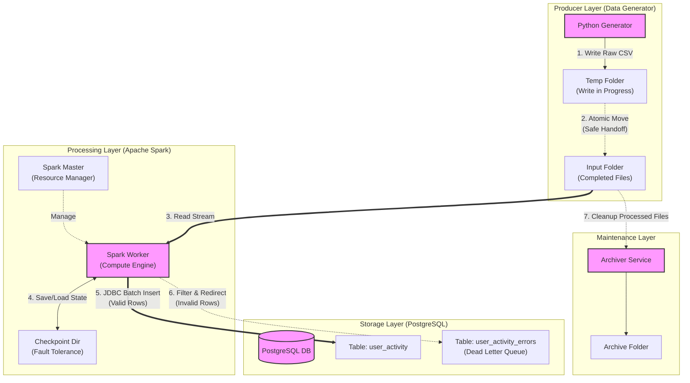

**Module:** DE05: Lab 2 - Real-Time Data Ingestion Using Spark & PostgreSQL

---

##  Project Overview

This project implements a robust, fault-tolerant real-time data pipeline that simulates an e-commerce platform. It generates synthetic user event data (views, purchases), streams it using **Apache Spark Structured Streaming**, and ingests the processed data into a **PostgreSQL** database for analytics.

The entire infrastructure is containerized using **Docker** to ensure reproducibility and isolation.

###  System Architecture

The pipeline is designed with **Fault Tolerance** and **Data Integrity** as core principles.



##  Tech Stack

* **Infrastructure:** Docker & Docker Compose
* **Orchestration:** Apache Spark (Master/Worker Architecture)
* **Streaming Engine:** Spark Structured Streaming (Python/PySpark)
* **Database:** PostgreSQL 15
* **Language:** Python 3.9+
* **Libraries:** Faker, Pandas, Psycopg2

---

##  Project Structure

```text
module lab 2/
├── data/
│   ├── input/             # Hot folder for new CSV files (Shared Volume)
│   ├── archive/           # Storage for processed files
│   └── checkpoints/       # Spark metadata for fault tolerance
├── sql/
│   └── postgres_setup.sql # Database schema initialization script
├── src/
│   ├── config.py          # Central configuration management
│   ├── logger_utils.py    # Unified logging utility
│   ├── archiver.py        # Service to move processed files
│   ├── data_generator.py  # Producer script (Fake Data)
│   └── spark_streaming_to_postgres.py # Consumer script (ETL)
├── Dockerfile             # Custom Spark image with Dependencies
├── docker-compose.yml     # Multi-container orchestration
├── requirements.txt       # Python dependencies
└── README.md              # Project Documentation
```

---

##  How to Run the Pipeline

### Prerequisites

* Docker Desktop installed and running.
* Internet access (to pull Docker images).

### Step 1: Start Infrastructure

Build the custom images and start the containers in detached mode. This launches Postgres, Spark Master/Worker, and the Archiver service.

```bash
docker-compose up --build -d
```

### Step 2: Verify Database

Ensure the `user_activity` and `user_activity_errors` tables were created.

```bash
docker exec -it postgres_db psql -U myuser -d ecommerce_db -c "\dt"
```

### Step 3: Start the Data Generator (Producer)

This script will start creating CSV files in the `data/input` folder.

```bash
docker exec -d spark_master python3 /app/src/data_generator.py
```
*Note: We use `-d` to run in background. You can check logs with `docker logs spark_master`.*

### Step 4: Submit the Spark Job (Consumer)

Run the Spark streaming job to start processing files.

```bash
docker exec -d spark_master /opt/spark/bin/spark-submit --jars /opt/spark/jars/postgresql-42.6.0.jar /app/src/spark_streaming_to_postgres.py
```

### Step 5: Verify Ingestion and DLQ

Check that valid rows are in `user_activity` and invalid ones (if any) are in `user_activity_errors`.

```bash
# Check valid rows
docker exec -it postgres_db psql -U myuser -d ecommerce_db -c "SELECT count(*) FROM user_activity;"

# Check DLQ (Dead Letter Queue)
docker exec -it postgres_db psql -U myuser -d ecommerce_db -c "SELECT * FROM user_activity_errors;"
```

---

##  Key Design Decisions

### 1. Atomic Writes (Data Integrity)

Standard streaming pipelines often fail if Spark attempts to read a file that is still being written.

* **Solution:** The generator writes data to a temporary folder (`data/temp`) first. Only when the file is closed and complete is it moved to the input folder (`data/input`). Spark only ever sees complete files.

### 2. Checkpointing (Fault Tolerance)

* **Solution:** A checkpoint directory is configured (`data/checkpoints`). If the Spark container crashes or is restarted, it resumes processing exactly where it left off, ensuring **At-Least-Once** delivery.

### 3. Schema Enforcement & Data Quality (DLQ)

* **Solution:** The Spark job enforces a strict `StructType` schema. Rows that violate business rules (e.g., negative price) are automatically filtered and sent to a **Dead Letter Queue (DLQ)** table `user_activity_errors` for later analysis, ensuring the main analytics table remains clean.

### 4. Automated Archiving

* **Solution:** To prevent the input directory from becoming bloated (which slows down Spark's file listing), a dedicated `archiver` service runs alongside the pipeline. It automatically moves processed files to `data/archive` based on a configurable age threshold.

### 5. Production Readiness

* **Configuration:** All credentials and paths are managed via `src/config.py` and environment variables.
* **Logging:** Centralized logging via `src/logger_utils.py` ensures consistent format across all services.
* **Graceful Shutdown:** Services handle termination signals to stop processing safely without data corruption.

---

##  Performance Metrics

* **Latency:** < 5 Seconds (Time from event generation to DB availability)
* **Throughput:** ~100 events/second (Single worker node)
* **Scalability:** Horizontally scalable by adding more Spark Worker containers.

---

##  Cleanup

To stop the pipeline and remove containers:

```bash
docker-compose down
```
