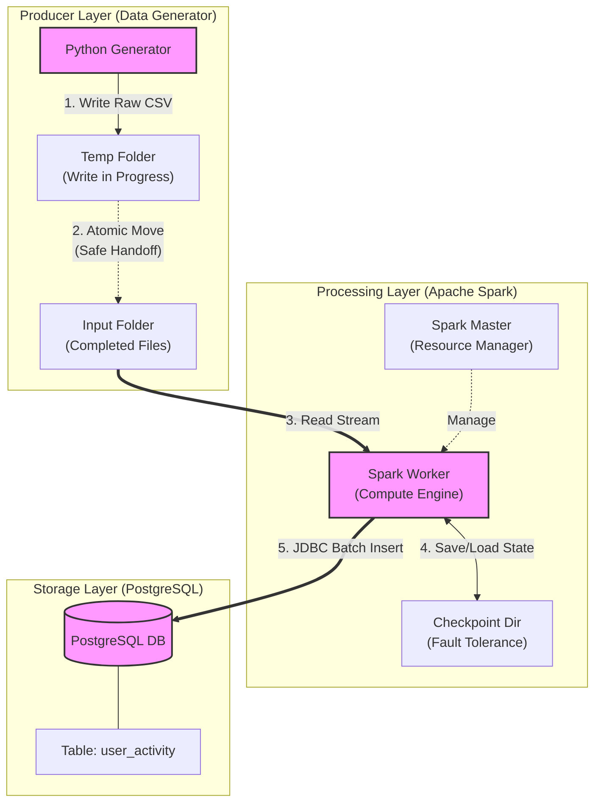

# Project Overview: Real-Time Data Ingestion Pipeline

## Executive Summary
This project implements a scalable, containerized data engineering pipeline designed to ingest, process, and store simulated e-commerce user events in real-time. The system mimics a production-grade ETL (Extract, Transform, Load) workflow, utilizing **Apache Spark Structured Streaming** for low-latency processing and **PostgreSQL** for persistent storage.

## Architectural Components

The system is built on a micro-services architecture orchestrated via Docker Compose, ensuring isolation and reproducibility.

### 1. The Producer (Data Generation)
* **Component:** Python Script (`data_generator.py`)
* **Function:** Simulates user behavior by generating synthetic "view" and "purchase" events.
* **Key Feature - Atomic Writes:** To prevent "file corruption" errors during streaming, the generator implements an atomic write strategy. Data is first written to a temporary staging area (`/data/temp`) and then moved to the input directory (`/data/input`) only when the write operation is complete.

### 2. The Consumer (Stream Processing)
* **Component:** Apache Spark Structured Streaming (`spark_streaming_to_postgres.py`)
* **Function:** continuously monitors the input directory for new CSV files.
* **Key Feature - Micro-Batch Processing:** Uses `foreachBatch` to process incoming data in small intervals (micro-batches), allowing for efficient JDBC (Java Database Connectivity) writes to the database.
* **Key Feature - Fault Tolerance:** Implements **Checkpointing** to store the processing state. If the system crashes, Spark can resume exactly where it left off without data loss or duplication.

### 3. The Storage Layer (Data Sink)
* **Component:** PostgreSQL Database (`postgres_db`)
* **Function:** Stores processed structured data in a relational format.
* **Schema Design:** Uses strict data typing (`TIMESTAMP`, `DECIMAL`) to ensure data integrity and enable accurate downstream analytics (e.g., revenue aggregation).

## Data Flow Diagram

1.  **Generate:** Random events created → Written to Temp.
2.  **Stage:** File moved to Input folder (Atomic Handoff).
3.  **Ingest:** Spark reads new file stream.
4.  **Transform:** Schema application and type casting.
5.  **Load:** Data written to `user_activity` table in PostgreSQL.